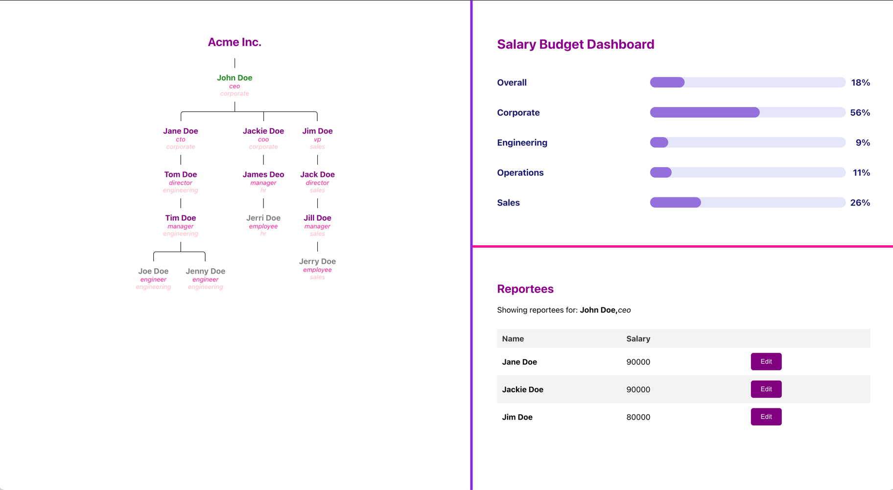

# get-stello-test

### Data Structures:
    a. Create a data structure that supports a flexible organizational structure.  
        Examples: Employee -> Manager -> Director -> VP -> CTO -> CEO
        Employee -> Manager -> Sr. Manager -> Director -> Sr. Director -> VP -> Sr. VP -> CTO -> CEO
    b. There could be any number of layers and roles.

### Write Functions:
    a. Find_max_number_of_direct_reports() — This function should return anyone in this organization with the highest number of direct reports
    b. Find_common_manager(employee1, employee2) — This function should return the lowest level of common manager of any given 2 employees.   
       For example, if two employees are under 2 completely different divisions that roll up to 2 different VPs, 
        then the common manager for those 2 employees is the CTO.

### Frontend Questions: 
    After implementing the data structure and functions above, please write frontend code for below:
    a. Write a view and control code to list all employees reporting to a manager
    b. Write code to list what their current salary is
    c. Write a function to allow their manager to update salary, and calculate the total change in department 
        budget based on salary update


# Implementation:
The implementation is done in Ruby for BE and React for FE.  

## Assumptions:
1. The organization structure is a tree.
2. Ceo is the head of the organisation.
3. Employees have unique names.
4. An employee can have only one manager.
5. Manager should have a higher authority than the employee.
6. Employees must have role and manager.

## Data Structures:
Flexible organizational structure is implemented using a tree data structure. Each node in the tree represents an employee.
The tree is built using the Employee class. Each employee has a name, title, salary, and a list of direct reports.

To allow flexibility in the organizational structure, we allow employee to have any manager of higher authority.


### Functions:
1. Find_max_number_of_direct_reports() — This function returns the employee with the highest number of direct reports.
2. Find_common_manager(employee1, employee2) — This function returns the lowest level of common manager of any given 2 employees.

## Unit Tests:
Unit tests are written using normal class file to keep the solution simple. The tests are written to test the functions of the organization class.
`OrganizationTest` class is used to test the organization class functions.

## How to run the code:
### Installation:
1. Install IRB https://github.com/ruby/irb?tab=readme-ov-file#installation

### Running the code:
1. Clone the repository.
2. Navigate to the root directory of the project.
3. Run the following command in the terminal:
`irb`
`require_relative 'start'`
4. Test data is already provided in the start.rb file. You can add more data to test the functions.
`start = Start.new`
5. Get organization:
`organization = start.organisation`
6. Find the employee with the highest number of direct reports:
`organization.find_max_number_of_direct_reports`
7. Find the common manager of two employees:
`organization.find_common_manager('Employee1', 'Employee2')`

### Running unit tests:
```
require_relative 'organization_test'
test = OrganizationTest.new
test.setup
test.execute
```

## Frontend:
Frontend is implemented using React. The frontend code is in the `get-stello-app` directory.

## How to run the frontend code:
1. Navigate to the `get-stello-app` directory.
2. Run the following command in the terminal:
`npm install`
`npm start`
3. Open the browser and navigate to `http://localhost:3000/` to view the frontend.


# Demo:

# Screenshot:

